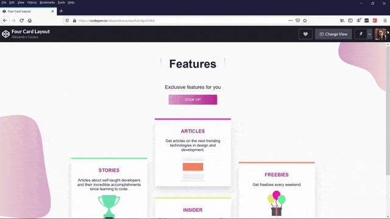

# Four Card Layout Project

 Responsive UI component with four card layout, built using HTML and SASS. 

 ## My editor and extensions

I've used [VS Code](https://code.visualstudio.com/) as the editor and [Parcel](https://parceljs.org/) to bundle the code.

[Live Example on CodePen](https://codepen.io/alexandracaulea/full/dyoOJKd)

