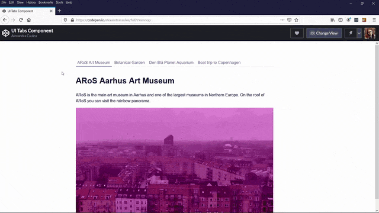

# UI Tabs Component Project

 UI Tab component built using HTML, SASS and JavaScript, focusing on accessibility as well.

## My editor and extensions

I've used [VS Code](https://code.visualstudio.com/) as the editor.
As the extensions, I've used [Live Server](https://marketplace.visualstudio.com/items?itemName=ritwickdey.LiveServer) and [Sass](https://marketplace.visualstudio.com/items?itemName=Syler.sass-indented).

[Live Example on CodePen](https://codepen.io/alexandracaulea/full/zYxmoop)

