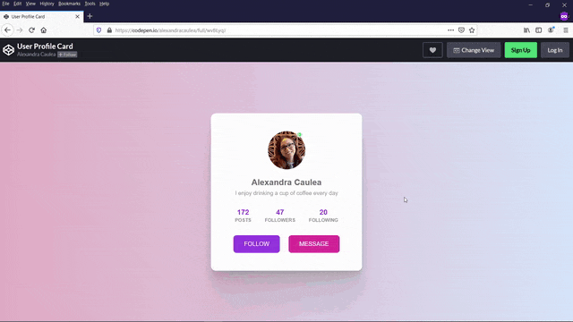

# User Profile Card Project

A responsive User Profile Card Component built using HTML and CSS.

## My editor and extensions

I've used [VS Code](https://code.visualstudio.com/) as the editor.
As the extension, I've used [Live Server](https://marketplace.visualstudio.com/items?itemName=ritwickdey.LiveServer).

[Live Example on CodePen](https://codepen.io/alexandracaulea/full/wvBLyqJ)

